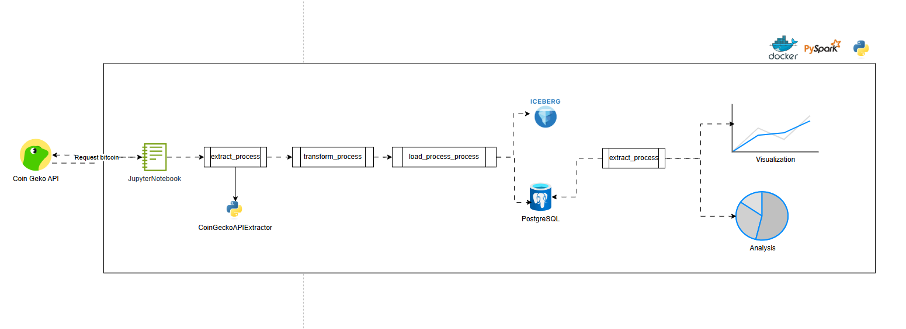
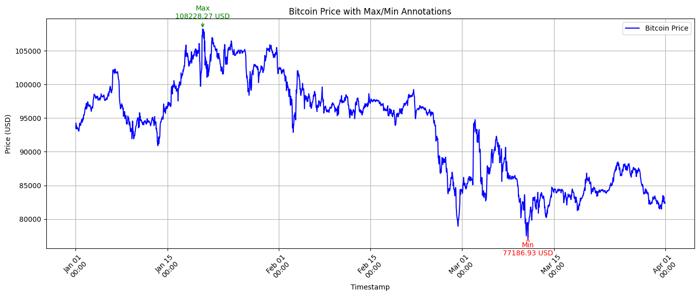
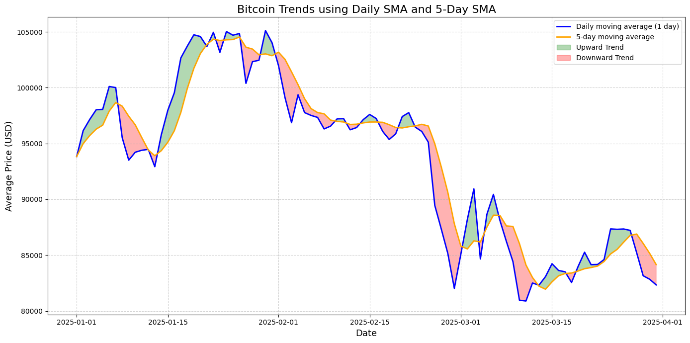
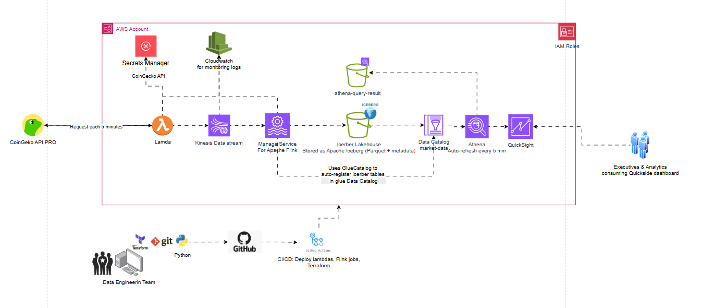

# 🪙 Coding Challenge - Bitcoin Price
---

## 🚀 Cómo levantar el proyecto

1. Clona el repositorio:
```bash
git clone https://github.com/javieramayapat/konfio_data_challenge.git
cd konfio_data_challenge/
```

2. Duplica el archivo de entorno:
```bash
cp .env.example .env
```

3. Ubícate dentro de la carpeta config-data-challenge y obtén la ruta absoluta con:
```bash
pwd
```

4.Copia esa ruta y pégala en la variable PATH_DEVELOP_SCRIPTS dentro del archivo .env.
Asegúrate de que la ruta termine en /develop y que uses barras diagonales (/), por ejemplo:
```bash
PATH_DEVELOP_SCRIPTS=/home/usuario/ruta/proyecto/development
```

5. Verifica que la carpeta development/ exista dentro del proyecto para evitar errores al montar los volúmenes.Luego, puedes continuar con:

```bash
docker-compose up --build
```

Esto inicia:
- Un contenedor de PySpark + JupyterLab
- Una base de datos PostgreSQL
- El entorno se monta con rutas específicas para warehouse/ (Iceberg) y drivers JDBC.

4. Abre el Jupyter Notebook:

- Navega a http://127.0.0.1:8888/lab
- Usa el toke del .env.example contenido en JUPYTER_TOKEN
- Abre el archivo: development/coding_challenge_bitcoin_price.ipynb
- Selecciona el kernel Python 3 y ejecuta run all

⚙️ Tecnologías utilizadas
- PySpark (modo local)
- Apache Iceberg (formato lakehouse en S3 local)
- PostgreSQL (vía Docker)
- CoinGecko API (demo key)
- JupyterLab (entorno interactivo)
- Docker & docker-compose
- Pre-commit + Ruff para formateo

## 📊 Proceso técnico

### 🔧 Diagrama de solución local



### 1. 🛠️ Extracción

Se utiliza la API de CoinGecko para obtener:

- Lista de criptomonedas disponibles
- Datos históricos de Bitcoin durante Q1 de 2025

> ⚠️ **Limitación**: la API demo solo permite acceder a datos del año en curso. Por tanto, los datos de Q1 2025 se obtuvieron simulando una fecha actual dentro del mismo año.

---

### 2. Transformación

El proceso de transformación fue diseñado para preparar los datos de CoinGecko para análisis técnico de forma precisa y estructurada. A continuación se detallan las decisiones clave:

- **Conversión de timestamp en milisegundos a segundos:**  
  CoinGecko entrega los precios con `timestamp_ms` (milisegundos desde UNIX). Para poder convertirlos al tipo `timestamp` en PySpark y aplicar funciones de ventana, fue necesario dividirlos entre `1000`.

- **Creación de la columna `event_date`:**  
  Como el análisis técnico requería calcular promedios móviles por día, se creó una columna `event_date` extrayendo solo la fecha (`yyyy-MM-dd`) desde el `timestamp`. Esto permitió agrupar precios por día específico y aplicar correctamente la ventana de 5 días ordenada cronológicamente.

- **Conservación del `timestamp_ms` original:**  
  Aunque se generó un `timestamp` legible, se conservó el valor original en milisegundos para poder graficar la evolución intradía del precio de Bitcoin con mayor granularidad.

- **Eliminación de duplicados:**  
  Se aplicó un `dropDuplicates()` sobre las columnas `timestamp_ms` y `price` para evitar registros duplicados entregados por la API.

- **Cálculo del `daily_avg_price`:**  
  Para construir la media móvil de 5 días, primero era necesario obtener un valor promedio por día. Agrupar directamente por `timestamp` no era viable, por lo que se usó `event_date` para calcular el promedio diario.

- **Cálculo de la `5-day moving average (sma_5d)`:**  
  Usando `event_date` como base, se aplicó una función de ventana ordenada por fecha para obtener una media móvil de 5 días, la cual fue solicitada explícitamente.

- **Unión final con metadata:**  
  Finalmente, se integraron las métricas calculadas (`daily_avg_price`, `sma_5d`, `event_date`) con los datos de contexto provenientes del endpoint de CoinList como `coin_id`, `name` y `symbol`, resultando en un dataset unificado listo para análisis y visualización.

---

### 3. 💾 Carga

Los resultados se almacenan en dos capas:

- **PostgreSQL** (para lectura relacional vía JDBC)
- **Apache Iceberg** en la carpeta `warehouse/` (modelo lakehouse optimizado para consultas analíticas)


### 4. Visualización de precios extremos

Se creó una visualización que muestra la evolución del precio de Bitcoin a lo largo del tiempo utilizando `timestamp_ms` como eje X y el precio como eje Y. Esto permite observar los picos de volatilidad con alta granularidad.  
Además, se identificaron de forma explícita:
- El **precio máximo** detectado: `$108,228.27 USD`
- El **precio mínimo** detectado: `$77,186.93 USD`  
Ambos ocurren dentro del primer trimestre de 2025, y permiten al analista identificar posibles zonas de entrada o salida en una estrategia de inversión.



### 5. Análisis técnico con medias móviles

Se aplicó una metodología de análisis técnico utilizando dos indicadores clave:

- **SMA diaria**: promedio del precio por día.
- **SMA de 5 días**: suaviza la serie para identificar tendencias sostenidas.

Ambas curvas se graficaron y se resaltaron visualmente:
- 🟩 **Verde**: cuando el promedio diario supera la SMA5 (tendencia alcista).
- 🟥 **Rojo**: cuando el promedio diario cae por debajo de la SMA5 (tendencia bajista).

**Observaciones clave:**
- En **enero 2025**, se detectaron periodos de crecimiento sostenido (tendencia alcista).
- A partir de **febrero**, la curva entra en fase bajista con cruces descendentes frecuentes.
- En **marzo**, se observó alta volatilidad y falta de dirección clara.

**Conclusión:**  
El análisis sugiere que, tras un pico en enero, Bitcoin mostró señales de corrección. La frecuencia de cruces bajistas indica una posible fase de consolidación. No se recomienda una inversión inmediata a corto plazo, pero sí monitoreo constante ante una posible reversión.




## ⚙️ Plan de Escalabilidad

Como plan de escalabilidad, propongo utilizar **AWS Lambda Functions** combinadas con una suscripción **PRO de CoinGecko API**, lo que nos permitirá realizar extracciones de datos cada 5 minutos de forma más estable. Dependiendo de los tipos de criptomonedas que deseemos mantener, se podrá ajustar dinámicamente la lista de IDs.

Las credenciales de la API serán gestionadas a través de **AWS Secrets Manager**, y recuperadas por la Lambda Function en tiempo de ejecución. Una vez obtenidos los datos, se publicarán en **Kinesis Data Streams**, donde serán procesados en tiempo real por **Apache Flink (Managed Service)**.

Flink se encargará de transformar los datos y guardarlos en un **bucket de S3** bajo el formato **Apache Iceberg**, el cual a su vez estará registrado en el **Glue Data Catalog** como una tabla de market data. A partir de ahí, la información podrá consultarse desde **Athena** o visualizarse en **QuickSight**, permitiendo al equipo de analítica monitorear los precios y comportamientos por moneda.

Para la parte de despliegue, propongo trabajar con un enfoque de infraestructura como código, utilizando **Terraform**, junto con **Git y Python** desde un repositorio en GitHub. A través de **GitHub Actions**, se podrán automatizar los despliegues de Lambdas, Flink Jobs y recursos definidos en Terraform.

Todos los componentes de AWS (Lambda, Kinesis, Flink, S3, Glue) estarán monitoreados mediante **CloudWatch**, y cada uno contará con su respectivo **IAM Role** configurado para mantener el principio de mínimo privilegio y reforzar la seguridad.

Por último, en cuanto a gobernanza de datos, no se permitirá que los usuarios finales definan las criptomonedas que desean analizar. En su lugar, cualquier nueva moneda deberá ser solicitada al equipo de datos, quien validará su valor y pertinencia. Esto evita problemas de duplicación, sobrecarga o inserción de IDs inválidos, y asegura el control del costo y la calidad de la información procesada.


